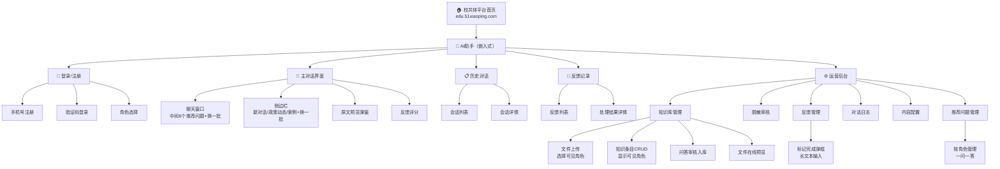
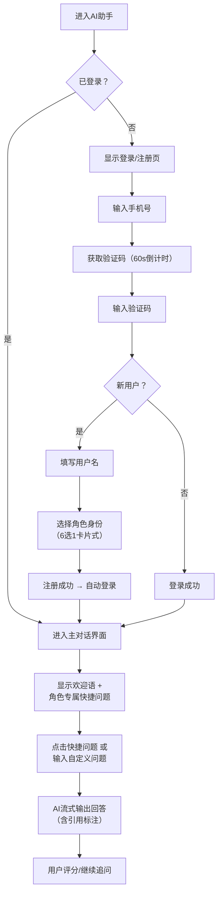
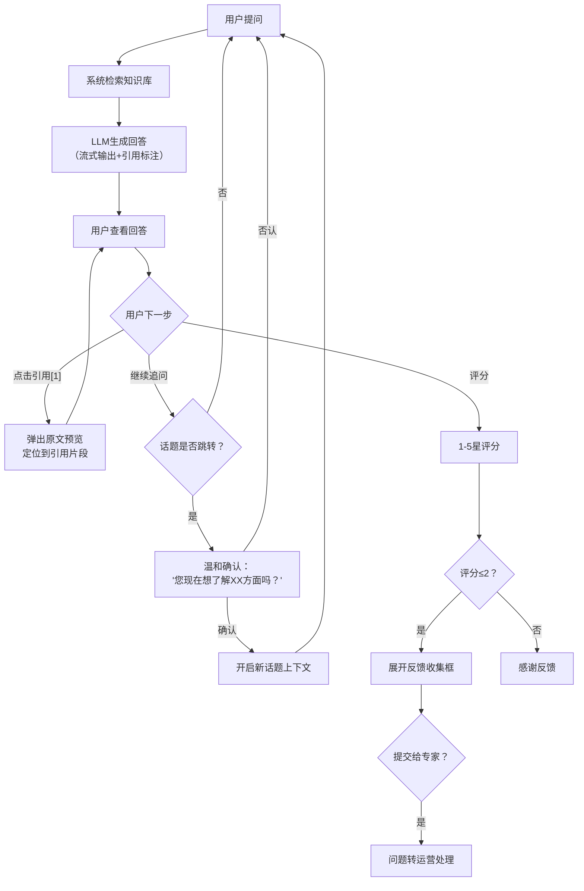
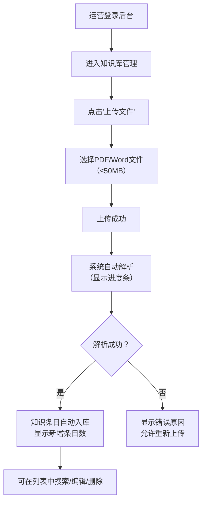

# 校共体AI助手 UI/UX 规范框架

本文档定义校共体AI助手项目的用户体验目标、信息架构、视觉设计规范及前端实现指南。设计风格基于 **edu.51xiaoping.com（河南城乡校共体发展平台）** 的现有视觉体系，确保AI助手作为嵌入模块与主站保持视觉一致性。

---

## 1. 总体 UX 目标与原则

### 1.1 目标用户画像

| 画像 | 角色描述 | 核心诉求 | 技术水平 |
|------|---------|---------|---------|
| **管理者** | 区域教育管理人员 | 快速获取政策解读、管理决策支持 | 中等，熟悉办公软件 |
| **核心校长** | 校共体牵头校人员 | 结对指导、经验分享、流程规范 | 中等 |
| **城镇教师** | 校共体成员校人员（城镇） | 教学案例学习、资源获取 | 中等 |
| **乡村教师** | 校共体成员校人员（乡村） | 低门槛操作、直白易懂的指导 | 偏低，需大字号、简洁交互 |
| **研究人员** | 教育研究者 | 深度政策分析、数据文献引用 | 较高 |
| **运营人员** | 后台管理者 | 高效管理知识库、审核内容、分析数据 | 较高 |

### 1.2 可用性目标

1. **低学习成本** — 乡村教师首次使用即可完成基本问答，无需培训
2. **高效操作** — 常用问题一键点击，3步内完成核心任务
3. **容错友好** — 口语化输入、错别字容错，错误提示清晰可操作
4. **移动优先** — 手机端体验流畅，适合教师碎片化使用场景
5. **可追溯性** — 政策引用可点击查看原文，增强信任感

### 1.3 设计原则

1. **庄重而亲和** — 兼顾政务属性与教育温度，不沉闷不花哨
2. **内容至上** — 以对话内容为核心，UI元素服务于信息传达
3. **渐进呈现** — 首屏简洁，高级功能通过侧边栏、弹窗按需展示
4. **一致性** — 与主站 edu.51xiaoping.com 视觉体系保持统一
5. **无障碍优先** — WCAG AA 标准，字号清晰、对比度充足、触控区域足够大

### 1.4 变更日志

| 日期 | 版本 | 描述 | 作者 |
|------|------|------|------|
| 2026-03-18 | v1.0 | 初始UI/UX规范框架 | 计成（UX专家） |
| 2026-04-01 | v1.1 | 确认Vue 3技术栈；侧边栏布局重构（推荐问题移至对话区、新对话按钮置顶、政策动态/案例加换一批）；对话区默认6个推荐问题+换一批；新增推荐问题管理页；反馈管理增强（完成弹框、用户反馈记录）；知识条目可见角色与文件预览 | 鲁班（架构师） |

---

## 2. 信息架构 (IA)

### 2.1 站点地图



### 2.2 导航结构

**主站导航（已有）：** 顶部水平导航栏，包含首页、新闻资讯、政策文件、示范校共同体、省外经验、研究文献、友情链接等模块。AI助手作为新增入口嵌入。

**AI助手内部导航：**
- **主导航：** 新对话 / 历史对话 / 反馈记录 / 返回主站
- **侧边导航：** 新对话按钮（顶部） / 政策动态+换一批 / 相关案例+换一批（基于角色动态展示）
- **面包屑：** 主站首页 > AI助手 > 当前会话

**运营后台导航：**
- **左侧垂直菜单：** 知识库管理 / 脱敏审核 / 问答审核 / 反馈管理 / 对话日志 / 内容配置 / 推荐问题管理 / 数据统计

---

## 3. 核心用户流程

### 3.1 新用户注册与首次对话

**用户目标：** 从零开始注册账号并完成第一次政策问答



**边缘情况：**
- 手机号已注册 → 提示"该手机号已注册，请直接登录"，提供登录入口
- 验证码错误 → 清空输入框，允许重新获取
- 网络异常 → "网络连接异常，请检查网络后重试"

### 3.2 多轮政策问答

**用户目标：** 就某一政策话题进行深入连续追问



### 3.3 运营后台-知识库管理

**用户目标：** 上传新政策文件并确认入库



---

## 4. 线框图与关键页面布局

### 4.1 设计文件

**主要设计工具：** 建议使用 Figma 进行高保真设计
**低保真布局：** 以下使用文本形式描述关键页面结构

### 4.2 关键页面

#### 页面1：登录/注册页

**用途：** 用户身份验证与注册

**布局结构：**
```
┌─────────────────────────────────────────────────┐
│  🔵 河南城乡校共体发展平台          [返回主站]    │  ← 顶部简化Header
├─────────────────────────────────────────────────┤
│                                                 │
│         ┌──────────────────────┐                │
│         │    🤖 AI智能助手      │                │
│         │                      │                │
│         │  ┌──────────────┐    │                │
│         │  │ 📱 手机号     │    │                │
│         │  └──────────────┘    │                │
│         │  ┌────────┐ [获取]   │                │
│         │  │ 验证码  │         │                │
│         │  └────────┘         │                │
│         │  ┌──────────────┐    │  ← 注册时显示   │
│         │  │ 用户名       │    │                │
│         │  └──────────────┘    │                │
│         │                      │                │
│         │  选择您的角色：        │  ← 注册时显示   │
│         │  ┌────┐ ┌────┐      │                │
│         │  │管理 │ │牵头│      │                │
│         │  └────┘ └────┘      │                │
│         │  ┌────┐ ┌────┐      │                │
│         │  │城镇 │ │乡村│      │                │
│         │  └────┘ └────┘      │                │
│         │  ┌────┐ ┌────┐      │                │
│         │  │研究 │ │其他│      │                │
│         │  └────┘ └────┘      │                │
│         │                      │                │
│         │  [████ 登录/注册 ████]│                │
│         └──────────────────────┘                │
│                                                 │
└─────────────────────────────────────────────────┘
```

**交互说明：**
- 角色选择为卡片式单选，选中高亮（主题蓝边框+浅蓝背景）
- 登录/注册按钮主题蓝色，全宽，高度 44px（移动端友好）
- 验证码获取按钮点击后变为60秒倒计时灰色文字

---

#### 页面2：主对话界面

**用途：** 核心聊天问答界面

**布局结构（桌面端）：**
```
┌──────────────────────────────────────────────────────────────┐
│  🔵 河南城乡校共体发展平台  AI助手  [历史] [反馈记录] [用户] │
├────────────────┬─────────────────────────────────────────────┤
│                │                                             │
│ [+ 新对话]     │  🤖 您好！我是校共体AI助手。               │
│                │     您当前身份：乡村教师                     │
│  历史会话列表   │                                             │
│  • 昨天的对话   │  ┌──────────────┐  ┌──────────────┐        │
│  • 上周的对话   │  │校共体怎么结对？│  │1+1+N模式是？  │        │
│                │  └──────────────┘  └──────────────┘        │
│ ─────────────  │  ┌──────────────┐  ┌──────────────┐        │
│                │  │评估指标有哪些？│  │如何线上备课？  │        │
│  ┌───────────┐ │  └──────────────┘  └──────────────┘        │
│  │ 📢 政策动态│ │  ┌──────────────┐  ┌──────────────┐        │
│  │  [换一批↻] │ │  │资源如何共享？  │  │考核标准是？   │        │
│  │ • 最新通知  │ │  └──────────────┘  └──────────────┘        │
│  │ • 文件更新  │ │              [🔄 换一批]                    │
│  └───────────┘ │                                             │
│                │  ─────────────────────────────────────      │
│  ┌───────────┐ │                                             │
│  │ 📚 相关案例│ │  👤 校共体怎么结对？                        │
│  │  [换一批↻] │ │                                             │
│  │ • 某小学经验│ │  🤖 根据《建设指南》第三章第二节[1]...      │
│  │ • 某中学案例│ │     ★ 评分 ☆☆☆☆☆                         │
│  └───────────┘ │                                             │
│                │  ┌─────────────────────────────────────┐   │
│                │  │ 输入您的问题...          [📎] [发送] │   │
│                │  └─────────────────────────────────────┘   │
├────────────────┴─────────────────────────────────────────────┤
│  © 河南城乡校共体发展平台                                     │
└──────────────────────────────────────────────────────────────┘
```

**布局结构（移动端）：**
```
┌────────────────────────┐
│ 🔵 AI助手  [≡] [+新对话]│
├────────────────────────┤
│                        │
│ 🤖 欢迎语              │
│                        │
│ [校共体怎么结对？]      │
│ [1+1+N是什么模式？]    │
│ [评估指标有哪些？]      │
│ [如何开展线上备课？]    │
│ [资源如何共享？]        │
│ [考核标准是什么？]      │
│       [🔄 换一批]       │
│                        │
│ ────────────────────   │
│                        │
│ 👤 校共体怎么结对？     │
│                        │
│ 🤖 回答内容...         │
│    引用[1]可点击       │
│    ★ 评分              │
│                        │
├────────────────────────┤
│ [输入问题...]   [发送]  │
└────────────────────────┘
  ↑ 侧边栏通过 [≡] 抽屉式弹出
  ↑ 侧边栏含：新对话、政策动态+换一批、案例+换一批
```

**交互说明：**
- 侧边栏宽度 280px，移动端为抽屉式覆盖
- 侧边栏顶部为"新对话"按钮（醒目位置），下方为历史会话列表，再下方为政策动态和相关案例区块
- 政策动态和相关案例区块标题右侧各有"换一批"按钮（↻图标+文字），点击刷新该区块内容
- 对话气泡：用户消息右对齐浅蓝背景，AI消息左对齐白色背景
- 流式输出时显示打字机光标动画
- 引用标注 `[1]` 为蓝色可点击链接样式
- 对话区空状态：中间展示6个推荐问题卡片（2列×3行网格），下方居中"换一批"按钮
- 推荐问题卡片：白色背景 + 主题蓝边框，圆角 20px，点击展示预设答案

---

#### 页面3：原文预览弹窗

**用途：** 展示被引用的政策原文

```
┌──────────────────────────────────────────┐
│  📄 《建设指南》第三章第二节     [✕ 关闭] │
├──────────────────────────────────────────┤
│                                          │
│  ...上下文内容...                         │
│                                          │
│  ┌────────────────────────────────────┐  │
│  │ 🟡 高亮引用片段                     │  │  ← 浅黄色高亮背景
│  │ "结对型城乡学校共同体采用1+1或      │  │
│  │  1+1+N模式，由一所城镇优质学校..."   │  │
│  └────────────────────────────────────┘  │
│                                          │
│  ...后续内容...                           │
│                                          │
├──────────────────────────────────────────┤
│  第 12 页 / 共 45 页     [< 上一页] [下一页 >]│
└──────────────────────────────────────────┘
```

---

#### 页面4：运营后台

**用途：** 知识库管理、审核、分析

```
┌──────────────────────────────────────────────────────────────────┐
│  🔵 校共体AI助手 · 运营后台                  [通知🔔] [管理员 ▾] │
├──────────┬───────────────────────────────────────────────────────┤
│          │  📂 知识库管理                                        │
│ 📂 知识库 │                                                      │
│ 📄 脱敏审核│  [🔍 搜索知识条目...]  [筛选▾]  [+ 上传文件]         │
│ ✅ 问答审核│                                                      │
│ 💬 反馈管理│  ┌────┬──────────┬──────┬────────────┬──────┬──────┐ │
│ 📊 对话日志│  │ ID │ 标题     │ 来源 │ 可见角色    │ 状态 │ 操作 │ │
│ ⚙️ 内容配置│  ├────┼──────────┼──────┼────────────┼──────┼──────┤ │
│ 📋 推荐问题│  │ 1  │ 建设指南 │ 文件 │ 全部       │ ✅   │ 编辑 │ │
│ 📈 数据统计│  │ 2  │ 结对模式 │ 问答 │ 管理/牵头  │ ✅   │ 编辑 │ │
│          │  │ 3  │ 评估标准 │ 文件 │ 全部       │ 🔄   │ 预览 │ │
│          │  └────┴──────────┴──────┴────────────┴──────┴──────┘ │
│          │                                                      │
│          │  显示 1-10 / 共 156 条          [< 1 2 3 ... 16 >]  │
└──────────┴───────────────────────────────────────────────────────┘
```

**知识条目交互说明：**
- 上传文件时弹出表单，包含文件选择和"可见角色"多选框（默认全选）
- 知识条目列表新增"可见角色"列，以标签形式展示
- 操作列增加"预览"按钮，已上传文件可在线查看（PDF直接预览、Word转PDF预览）

**反馈管理交互说明：**
- 运营点击"标记完成"时弹出 Modal 弹框
- 弹框包含长文本输入区域（textarea，最小高度 120px），标题为"请输入处理结果"
- 输入内容不少于10个字符，否则"确认"按钮禁用
- 确认后反馈状态变为"已完成"，处理结果文本展示给用户

**推荐问题管理交互说明：**
- 页面顶部按角色Tab切换（6个角色Tab）
- 每条推荐问题包含"问题"和"答案"两个字段（一问一答）
- 支持拖拽排序、新增、编辑、删除
- 前端对话区默认展示6条，下方"换一批"按钮

---

## 5. 组件库 / 设计系统

### 5.1 设计系统方案

**基础框架：** Vue 3 + Element Plus（与主站 edu.51xiaoping.com 技术栈一致，已确认）

**完整技术栈：** Vue 3 + Element Plus + Pinia（状态管理）+ Vue Router（路由）+ Axios（HTTP请求）

**定制策略：** 基于 Element Plus 默认主题，通过 CSS 变量覆盖实现与主站一致的品牌风格。不引入额外组件库，确保打包体积和视觉风格统一。

### 5.2 核心组件

#### 组件：消息气泡 (ChatBubble)

**用途：** 对话界面中用户和AI的消息展示

**变体：**
- `user` — 用户消息，右对齐，蓝色背景白色文字
- `assistant` — AI消息，左对齐，白色背景深色文字，含引用标注
- `system` — 系统提示，居中，浅灰背景小字

**状态：** 默认、加载中（骨架屏/打字动画）、发送失败（红色警告+重试按钮）

**使用规范：**
- 最大宽度 70%（桌面）/ 85%（移动）
- 内边距 12px 16px
- 圆角 12px（自己一侧 4px）
- AI消息支持 Markdown 渲染

---

#### 组件：引用标注 (CitationTag)

**用途：** 回答中的政策引用来源标识

**变体：**
- `inline` — 行内 `[1]` 蓝色链接样式
- `footer` — 回答底部引用列表卡片

**状态：** 默认蓝色、悬停下划线、已访问紫色

**使用规范：**
- 行内标注：字号与正文一致，颜色 `--color-primary`
- 底部引用列表：灰色分隔线上方，字号 13px，左侧蓝色竖线标识

---

#### 组件：快捷问题按钮 (QuickQuestion)

**用途：** 欢迎屏对话区域中间的推荐问题展示（不再用于侧边栏）

**变体：**
- `pill` — 胶囊形按钮，用于欢迎屏
- `list-item` — 列表项样式，用于侧边栏

**状态：** 默认、悬停（浅蓝背景）、按下

**使用规范：**
- pill 样式：高度 36px，圆角 20px，白色背景 + 主题蓝边框
- 悬停：背景变为 `#ecf5ff`，边框加深
- 文字不超过 30 字，超出省略号

---

#### 组件：评分反馈 (FeedbackRating)

**用途：** 每条AI回答下方的满意度评分

**变体：**
- `compact` — 仅显示5星评分
- `expanded` — 评分 + 反馈原因选择 + 文本框

**状态：** 未评分、已评分、展开反馈框、提交中、已提交

**使用规范：**
- 星星图标大小 20px，间距 4px
- 已选星星颜色 `#e6a23c`（琥珀色）
- 评分≤2 自动展开反馈框

---

#### 组件：侧边栏面板 (SidePanel)

**用途：** 新对话入口、历史会话、政策动态推送、相关案例推送

**变体：**
- `desktop` — 固定在左侧，280px 宽
- `mobile` — 抽屉式，从左侧滑入覆盖

**状态：** 展开、折叠、加载中

**使用规范：**
- 背景 `#f7f8fa`
- 顶部放置"+ 新对话"按钮（主题蓝色，全宽，高度 40px）
- 下方为历史会话列表
- 再下方为"政策动态"和"相关案例"区块，各区块标题右侧显示"换一批"操作链接
- 各区块用 section 标题分隔（蓝色左竖线 + 粗体标题）
- "换一批"按钮为文字链接样式（`--color-primary`），带 ↻ 图标
- 移动端通过汉堡菜单切换
- **注意：** 侧边栏不再放置推荐问题（已移至对话区域中间展示）

---

## 6. 品牌与视觉规范

### 6.1 美学方向

**设计定位：** 政务教育专业风格 — 庄重、可信、简洁

**标志性视觉元素：** 蓝白色调体系 + 蓝色左竖线区块标题（与主站一致）

**参考来源：** edu.51xiaoping.com 现有视觉体系，政务教育类网站通用范式

### 6.2 配色方案

基于主站 CSS 提取，应用 60-30-10 配色法则：

| CSS 变量 | 色值 | 角色 | 对比度 | 用途 |
|----------|------|------|--------|------|
| `--color-primary` | `#1283e9` | 10% 强调 | 4.6:1 on white | 主交互色：按钮、链接、导航高亮、引用标注 |
| `--color-primary-light` | `#409eff` | — | — | Element Plus 默认主色，按钮悬停态 |
| `--color-primary-bg` | `#ecf5ff` | — | — | 选中态背景、快捷按钮悬停 |
| `--color-background` | `#ffffff` | 60% 主体 | — | 页面主背景、对话区、卡片 |
| `--color-surface` | `#f0f2f5` | 30% 次级 | — | 页面容器背景、侧边栏、输入区 |
| `--color-surface-alt` | `#f7f8fa` | — | — | 侧边栏、代码块背景 |
| `--color-text` | `#1a1a1a` | — | 15.6:1 on white | 主标题、正文文字 |
| `--color-text-regular` | `#333333` | — | 12.6:1 on white | 常规正文 |
| `--color-text-secondary` | `#666666` | — | 5.7:1 on white | 次要说明文字 |
| `--color-text-placeholder` | `#999999` | — | 3.5:1 on white | 占位符、时间标签 |
| `--color-success` | `#67c23a` | — | 3.3:1 on white | 成功状态、已通过 |
| `--color-warning` | `#e6a23c` | — | 3.0:1 on white | 警告提示、评分星星 |
| `--color-danger` | `#f56c6c` | — | 3.2:1 on white | 错误、删除操作 |
| `--color-info` | `#909399` | — | 3.7:1 on white | 信息提示、禁用态 |
| `--color-border` | `#e5e5e5` | — | — | 分割线、输入框边框 |
| `--color-border-light` | `#eeeeee` | — | — | 卡片边框、表格线 |

**用户消息气泡色：**
| CSS 变量 | 色值 | 用途 |
|----------|------|------|
| `--color-bubble-user` | `#1283e9` | 用户消息背景 |
| `--color-bubble-user-text` | `#ffffff` | 用户消息文字 |
| `--color-bubble-assistant` | `#ffffff` | AI消息背景 |
| `--color-bubble-assistant-text` | `#333333` | AI消息文字 |

### 6.3 背景与氛围

**背景策略：** 主站采用纯白+浅灰分区的简洁分层策略，AI助手沿用此风格。对话区白色背景，页面容器 `#f0f2f5` 浅灰色，营造清晰的层次感。

**纹理/图案：** 无纹理、无渐变背景。通过阴影层级和颜色分区建立空间感。

**深色模式：** v1.0 暂不支持。后续可通过 CSS 变量体系快速扩展。

### 6.4 字体体系

#### 字体族

- **标题/显示：** `"Microsoft YaHei", "微软雅黑", "PingFang SC", "Hiragino Sans GB", sans-serif` — 主站一致，中文系统字体首选，无需额外加载
- **正文：** 同上（中文场景下标题与正文通常使用同一字体族，通过字重和字号区分层级）
- **等宽：** `"Consolas", "Monaco", "Microsoft YaHei", monospace` — 代码片段和引用编号

**字体加载策略：** 使用系统字体栈，零额外网络请求，确保最佳首屏渲染性能

#### 字号层级

| 元素 | CSS 变量 | 字号 | 字重 | 行高 | 字间距 |
|------|---------|------|------|------|--------|
| Display（页面大标题） | `--text-display` | 28px | 700 | 1.3 | -0.02em |
| H1（板块标题） | `--text-h1` | 24px | 700 | 1.4 | -0.01em |
| H2（区块标题） | `--text-h2` | 20px | 600 | 1.4 | normal |
| H3（子标题） | `--text-h3` | 18px | 600 | 1.5 | normal |
| Body（正文） | `--text-body` | 16px | 400 | 1.75 | normal |
| Body-sm（紧凑正文） | `--text-body-sm` | 14px | 400 | 1.5 | normal |
| Small（辅助文字） | `--text-small` | 13px | 400 | 1.5 | normal |
| Caption（标签/时间） | `--text-caption` | 12px | 400 | 1.4 | 0.02em |

> **注意：** 考虑乡村教师用户群体，对话区正文采用 16px（而非 Element Plus 默认的 14px），确保可读性。移动端输入框字号不小于 16px 以避免 iOS 自动缩放。

### 6.5 图标体系

**图标库：** Element Plus Icons（与框架一致）+ 自定义补充图标

**图标尺寸：**
| 场景 | 尺寸 | 用途 |
|------|------|------|
| 行内图标 | 16px | 按钮内图标、列表图标 |
| 标准图标 | 20px | 导航图标、操作按钮 |
| 大图标 | 24px | 空状态图标、功能入口 |
| 展示图标 | 48px | 空状态插图、引导图标 |

**使用规范：** 线性风格为主，2px 线宽，颜色继承父元素或使用 `--color-text-secondary`

### 6.6 间距与布局

**基础单位：** 4px

**间距刻度：**

| Token | 值 | 用途 |
|-------|------|------|
| `--space-1` | 4px | 紧凑内联间距 |
| `--space-2` | 8px | 相关元素间距、图标与文字 |
| `--space-3` | 12px | 表单字段间距 |
| `--space-4` | 16px | 组件默认内边距 |
| `--space-5` | 20px | 卡片内边距 |
| `--space-6` | 24px | 区块内部间距 |
| `--space-8` | 32px | 卡片间距、组件间隔 |
| `--space-12` | 48px | 板块间距 |
| `--space-16` | 64px | 页面级板块分隔 |

**网格系统：** Element Plus 24列栅格（与主站一致）

**最大内容宽度：** 1200px（主站内容区宽度），居中显示

**对话区布局：**
- 侧边栏：固定 280px
- 对话区：自适应剩余宽度，最大 800px 消息宽度
- 消息气泡：最大宽度 70%

### 6.7 阴影与层级

| 层级 | CSS 变量 | 值 | 用途 |
|------|---------|------|------|
| Subtle | `--shadow-sm` | `0 1px 2px rgba(0,0,0,0.05)` | 卡片静态、输入框 |
| Default | `--shadow-md` | `0 4px 6px rgba(0,0,0,0.1)` | 下拉菜单、弹出提示 |
| Medium | `--shadow-lg` | `0 10px 15px rgba(0,0,0,0.1)` | 弹窗、对话框 |
| Header | `--shadow-header` | `0 2px 8px rgba(0,0,0,0.15)` | 顶部导航栏固定阴影 |
| EL-Plus | `--shadow-el` | `0 12px 32px 4px rgba(0,0,0,0.04), 0 8px 20px rgba(0,0,0,0.08)` | Element Plus 弹层 |

### 6.8 圆角

| Token | 值 | 用途 |
|-------|------|------|
| `--radius-none` | 0 | 表格、全宽元素 |
| `--radius-sm` | 2px | 输入框、小按钮 |
| `--radius-md` | 4px | 卡片、标准按钮、Element Plus 默认 |
| `--radius-lg` | 8px | 弹窗、大面积容器 |
| `--radius-xl` | 12px | 消息气泡 |
| `--radius-pill` | 20px | 快捷问题按钮、标签 |
| `--radius-full` | 9999px | 头像、圆形图标按钮 |

---

## 7. 无障碍要求

### 7.1 达标标准

**标准：** WCAG 2.1 AA

### 7.2 关键要求

**视觉：**
- 文字对比度：正文 ≥ 4.5:1，大文字（18px+ 粗体或 24px+）≥ 3:1
- 焦点指示器：所有可交互元素必须有清晰的 focus 轮廓（2px `--color-primary` outline）
- 文字缩放：支持浏览器 200% 缩放不破坏布局

**交互：**
- 键盘导航：所有功能可通过 Tab/Enter/Esc/方向键操作；对话输入区 Enter 发送、Shift+Enter 换行
- 屏幕阅读器：所有图标和图片提供 aria-label；对话消息使用 role="log" + aria-live="polite"
- 触控目标：最小 44×44px（适配乡村教师手机操作）

**内容：**
- 替代文本：所有非装饰性图片、图标提供描述文本
- 标题层级：严格按 H1→H2→H3 嵌套，不跳级
- 表单标签：每个输入框关联 label，错误提示关联 aria-describedby

### 7.3 测试策略

- 开发阶段：axe-core 自动扫描集成到 CI
- 手动测试：键盘全流程走查 + NVDA/VoiceOver 屏幕阅读器验证
- 真实设备：在低端 Android 手机上测试字号可读性和触控区域

---

## 8. 响应式策略

### 8.1 断点定义

| 断点 | 最小宽度 | 最大宽度 | 目标设备 |
|------|---------|---------|---------|
| Mobile | 320px | 767px | 手机（竖屏） |
| Tablet | 768px | 1023px | 平板、手机横屏 |
| Desktop | 1024px | 1399px | 笔记本、桌面显示器 |
| Wide | 1400px | — | 大屏显示器 |

### 8.2 适配策略

**布局变化：**
- Mobile：单栏布局，侧边栏变为底部 Sheet 或抽屉式弹出
- Tablet：对话区全宽，侧边栏可折叠/覆盖
- Desktop：左侧边栏 + 右侧对话区双栏布局
- Wide：内容区最大 1200px 居中，两侧留白

**导航变化：**
- Mobile：顶部简化为 Logo + 汉堡菜单 + 新对话按钮
- Tablet+：完整顶部导航栏

**内容优先级：**
- Mobile 优先展示对话区和输入框，侧边栏内容按需加载
- 快捷问题按钮移动端横向可滚动，桌面端网格排列

**交互变化：**
- Mobile：底部固定输入框，向上滚动时自动隐藏顶栏腾出空间
- 桌面端：输入框在对话区底部固定

---

## 9. 动效与交互编排

### 9.1 动效原则

**理念：** 克制而有目的 — 动效服务于反馈和引导，不做纯装饰性动画。教育政务场景需要稳重感。

**默认时序：**

| 交互类型 | 时长 | 缓动函数 |
|---------|------|---------|
| 微交互（悬停/焦点） | 150ms | ease-out |
| 布局过渡（侧边栏展开） | 300ms | cubic-bezier(0.33, 1, 0.68, 1) |
| 弹窗进入/退出 | 250ms | cubic-bezier(0.16, 1, 0.3, 1) |
| 消息气泡出现 | 200ms | ease-out |
| 流式文字输出 | 逐字 20-40ms | linear |

**减弱动效适配：** 尊重 `prefers-reduced-motion: reduce`，禁用所有过渡动画，仅保留即时状态切换

### 9.2 关键动效时刻

1. **流式输出打字效果：** AI回答逐字显示，末尾闪烁光标 `|`，营造实时生成感
   - 触发：收到 SSE 流数据
   - 时长：随数据流持续 | 缓动：linear
   - 减弱动效替代：整段直接显示

2. **消息气泡入场：** 用户/AI消息从底部淡入上滑 8px
   - 触发：新消息到达
   - 时长：200ms | 缓动：ease-out
   - 减弱动效替代：无动画直接显示

3. **快捷问题点击反馈：** 按钮缩放 0.95→1.0 + 涟漪效果，随后消息发送
   - 触发：点击快捷问题
   - 时长：150ms | 缓动：ease-out

4. **原文预览弹窗：** 底部滑入 + 背景遮罩淡入
   - 触发：点击引用标注
   - 时长：300ms | 缓动：cubic-bezier(0.33, 1, 0.68, 1)
   - 减弱动效替代：即时显示

5. **评分星星动画：** 依次点亮，每颗星星延迟 50ms，带轻微缩放弹跳
   - 触发：用户点击星星
   - 时长：150ms/颗 + 50ms 错开 | 缓动：ease-out

---

## 10. 性能考量

### 10.1 性能目标

- **首屏加载：** LCP < 2s（对话界面），FID < 100ms
- **交互响应：** 用户发送消息到首个流式字符出现 < 1.5s
- **动画帧率：** 所有动画保持 60fps

### 10.2 设计策略

- 使用系统字体栈，零字体文件加载
- 对话消息列表使用虚拟滚动（超过100条时）
- 侧边栏推荐内容懒加载
- 原文预览弹窗按需加载 PDF 渲染器
- 图片使用 WebP 格式 + 响应式 srcset
- SSE 流式输出减少用户等待感知时间

---

## 11. UI 状态矩阵

每个核心界面需处理以下 4 种状态：

| 页面/组件 | 空状态 | 加载中 | 错误状态 | 成功状态 |
|-----------|--------|--------|---------|---------|
| **对话区（首次进入）** | 欢迎语 + 6个推荐问题 + 换一批 | — | — | — |
| **对话区（已有对话）** | — | 骨架屏/打字光标 | "发送失败，点击重试" | 消息正常显示 |
| **AI回答** | — | "正在思考..." + 脉冲点动画 | "智能助手暂时繁忙，请稍后重试" | 流式输出完成 |
| **引用预览** | — | 骨架屏 | "原文加载失败" + 纯文本替代 | PDF/文档正常预览 |
| **侧边栏资源** | "暂无推荐内容" | 3行骨架卡片 | 静默降级，不显示 | 政策动态/案例列表 + 换一批 |
| **推荐问题区** | "暂无推荐问题" | 6个骨架卡片 | 仅显示欢迎语和输入框 | 6个推荐问题卡片 + 换一批 |
| **反馈记录列表** | "暂无反馈记录" | 列表骨架屏 | "加载失败，点击刷新" | 反馈列表 + 处理结果 |
| **文件预览** | — | 加载中骨架屏 | "文件预览失败" | PDF/文档在线预览 |
| **处理完成弹框** | 空textarea + 禁用确认按钮 | 提交中（按钮loading） | "提交失败，请重试" | 关闭弹框 + 状态更新 |
| **历史对话列表** | "还没有对话记录，开始您的第一次提问吧" | 列表骨架屏 | "加载失败，点击刷新" | 会话列表 |
| **评分反馈** | 5颗空心星 | 提交中（按钮loading） | "评分提交失败，请重试" | "感谢您的反馈" |
| **知识库列表（后台）** | "暂无知识条目，上传文件开始构建" | 表格骨架屏 | 错误Toast | 数据表格 |
| **文件上传（后台）** | 拖拽上传区域 | 进度条 + 百分比 | "解析失败：[原因]" | "✓ 已成功入库 X 条" |

---

## 12. 前端交接规格汇总

### 12.1 组件 Props/变体速查

| 组件 | Props | 事件 | 验证规则 |
|------|-------|------|---------|
| `ChatBubble` | `type: 'user'\|'assistant'\|'system'`, `content: string`, `citations?: Citation[]`, `status: 'sending'\|'sent'\|'error'` | `@retry` | content 非空 |
| `CitationTag` | `index: number`, `source: string`, `page?: number` | `@click` | index > 0 |
| `QuickQuestion` | `text: string`, `variant: 'pill'\|'list-item'` | `@click` | text ≤ 30字 |
| `RecommendedQuestion` | `question: string`, `answer: string`, `variant: 'card'\|'compact'` | `@click` | question 非空, answer 非空 |
| `RefreshButton` | `label?: string`, `loading: boolean` | `@refresh` | — |
| `FeedbackRecord` | `feedbackId: string`, `status: 'pending'\|'processing'\|'completed'`, `result?: string` | `@view-detail` | feedbackId 非空 |
| `FilePreview` | `fileId: string`, `fileType: 'pdf'\|'docx'`, `fileName: string` | `@close` | fileId 非空 |
| `RoleTagSelect` | `selected: UserRole[]`, `multiple: true` | `@change(roles)` | — |
| `ResolveDialog` | `feedbackId: string`, `visible: boolean` | `@confirm(text)`, `@cancel` | text.length ≥ 10 |
| `FeedbackRating` | `messageId: string`, `score?: number` | `@rate(score)`, `@submit(feedback)` | score 1-5 |
| `SidePanel` | `role: UserRole`, `collapsed: boolean`, `showNewChat: true` | `@toggle`, `@new-chat`, `@refresh-section(section)` | — |
| `DocPreview` | `documentId: string`, `page: number`, `highlight: string` | `@close`, `@page-change` | documentId 非空 |

### 12.2 响应式规则速查

| 组件 | Mobile (<768px) | Tablet (768-1023px) | Desktop (≥1024px) |
|------|----------------|--------------------|--------------------|
| 侧边栏 | 抽屉覆盖 | 可折叠覆盖 | 固定左侧 280px |
| 消息气泡 | max-width: 85% | max-width: 75% | max-width: 70% |
| 推荐问题 | 单列列表 + 换一批 | 2列网格 + 换一批 | 2列×3行网格 + 换一批 |
| 导航栏 | Logo + 汉堡 | 完整导航 | 完整导航 |
| 输入框 | 底部固定满宽 | 底部固定满宽 | 对话区底部 |

### 12.3 错误消息规范

| 场景 | 用户可见消息 | 样式 |
|------|-------------|------|
| 网络断开 | "网络连接异常，请检查网络后重试" | 顶部 Warning Bar |
| AI服务不可用 | "智能助手暂时繁忙，请稍后重试" | 气泡内 Error 状态 |
| 消息发送失败 | "发送失败，点击重试" | 气泡右侧红色 ⚠ + 重试按钮 |
| Token过期 | "登录已过期，请重新登录" | 全局 Modal |
| 文件格式错误 | "仅支持 PDF 和 Word(.docx) 文件" | Toast Warning |
| 文件过大 | "文件大小不能超过 50MB" | Toast Warning |

---

## 13. 下一步

### 13.1 即时行动

1. 基于本规范在 Figma 中创建高保真设计稿（优先：主对话界面 + 登录页）
2. 建立 Element Plus 主题变量覆盖文件，实现品牌配色
3. ~~与架构师确认前端技术栈（Vue 3 + Element Plus）~~ ✅ 已确认：Vue 3 + Element Plus + Pinia + Vue Router
4. 创建核心组件的 Storybook 文档

### 13.2 设计交接检查清单

- [x] 所有用户流程已文档化
- [x] 组件库清单完整
- [x] 无障碍要求已定义
- [x] 响应式策略清晰
- [x] 品牌规范已整合
- [x] 性能目标已建立
- [ ] Figma 高保真设计稿（待创建）
- [ ] 组件 Storybook 示例（待开发阶段）

---

## 14. 检查清单结果

> 本规范基于 edu.51xiaoping.com 网站实际分析（截图 + CSS 提取）和项目 PRD 编写。所有配色和字体数据来源于主站 `entry.DHfzrPx8.css` 文件实际提取值，确保与主站视觉风格一致。
